# FERCV
## Prikaz rada aplikacije
Na narednim slikam moguće je videti način rada apikacije. Za potrebe diplomskog rada, radili smo prepoznavanje i analizu emocija na video snimku na kome se nalaze studenti u učionici koji čekaju usmeni deo ispita. Sam rad aplikacije se može podeliti na 2 dela.
1. **Prepoznavanje  i detekcija lica**- korišćen je DNN iz OpenCV biblioteke
2. **Prepoznavanje i klasifikacija emocija** - korišćena je  naša pretrenirana neuronska mreža
Kao što je i moguće videti u nastavku, imamo da se najpre detektuju lica, pri čemu sistem svako detektovano lice označava  zelenom pravougaonom oblašču, a nakon toga se iznad pravougaonika ispisuje emocija koju je sistem detektovao, odnosno prepoznao kao takvu.

    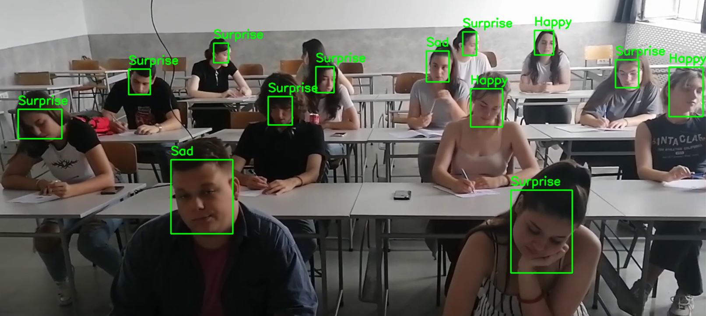
   
   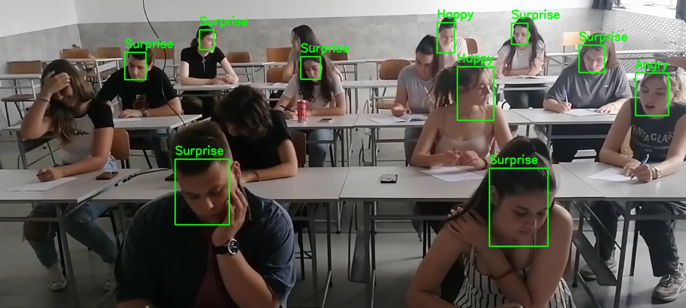

    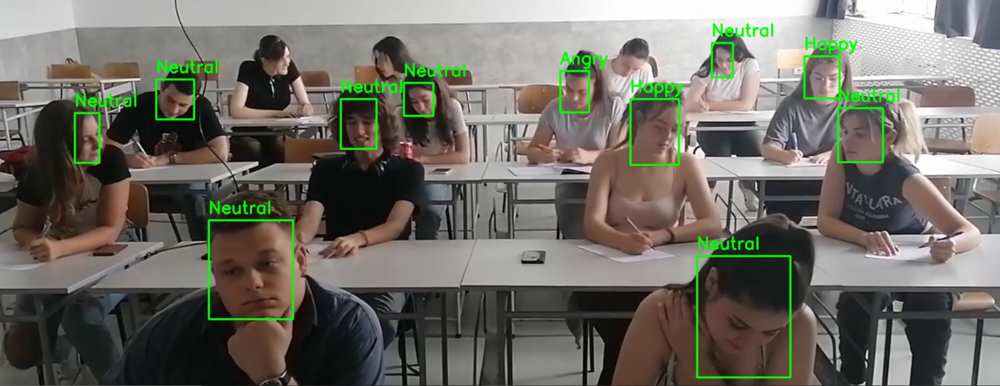
  
## Statistički prikaz emocionalne analize
U nastavku možete pogledati statistički prikaz analize emocija koju smo zahvaljujući našem sistemu odradili za predhodno importovani video o kome je ranije bilo reči. Radi postizanje dinamičnosti, video je podeljen na intervale od 30s, a za svaki od intervala ije odrađena analiza emocija, pri čemu video traje 5 minuta, tako da imamo 10 intervala koje smo emocionalno analizirali.

  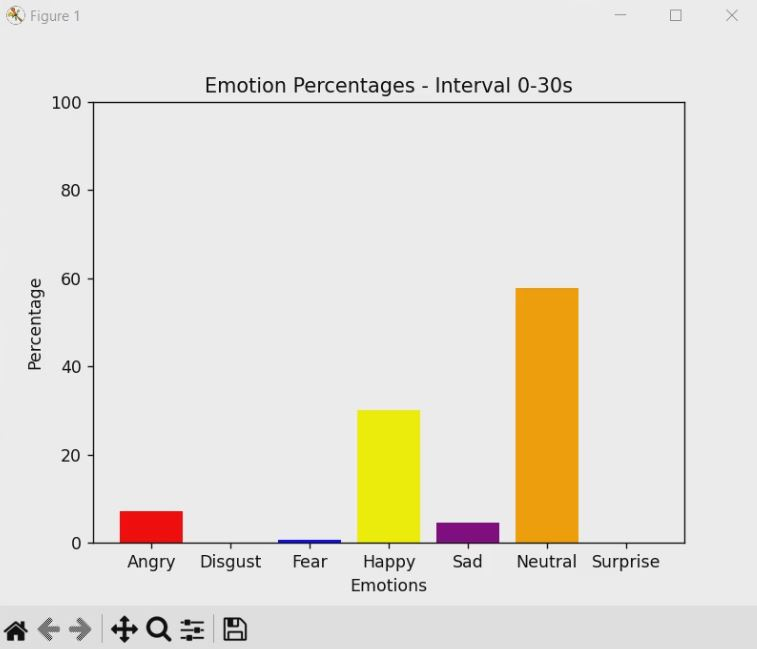

  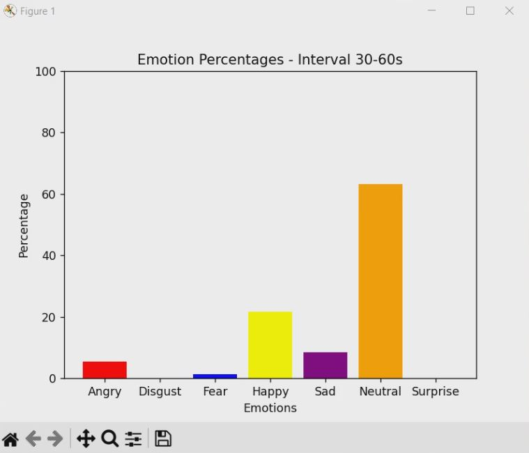

  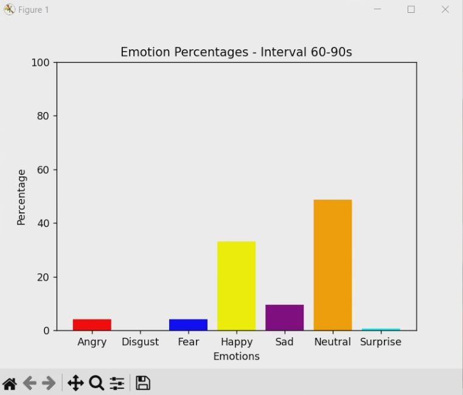

  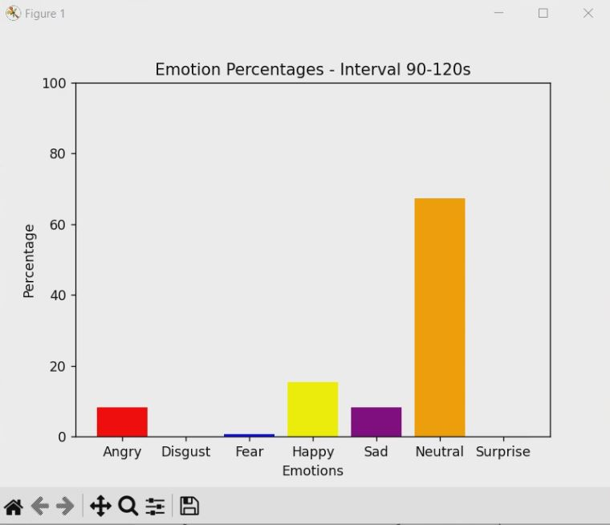

  

  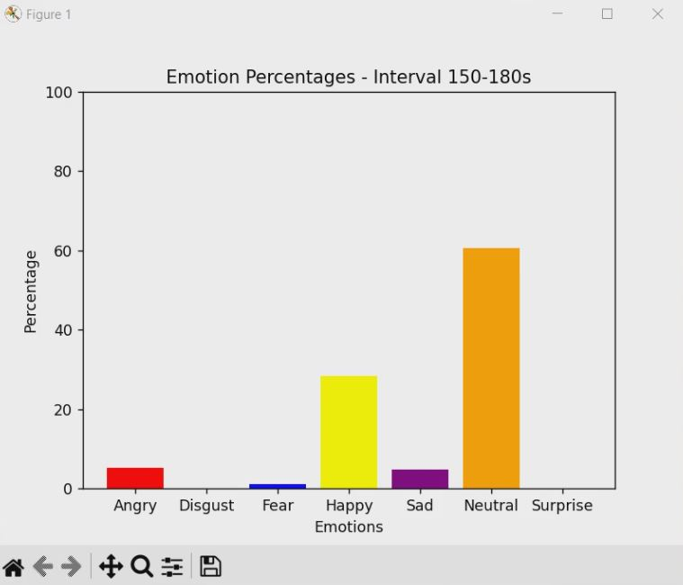

  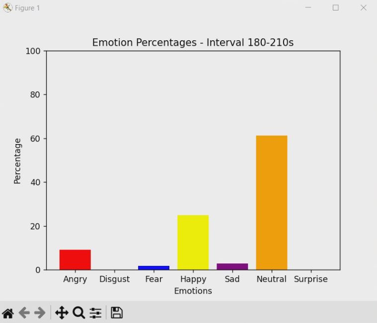

  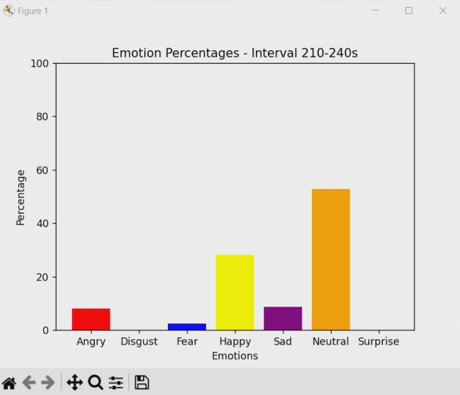

  

  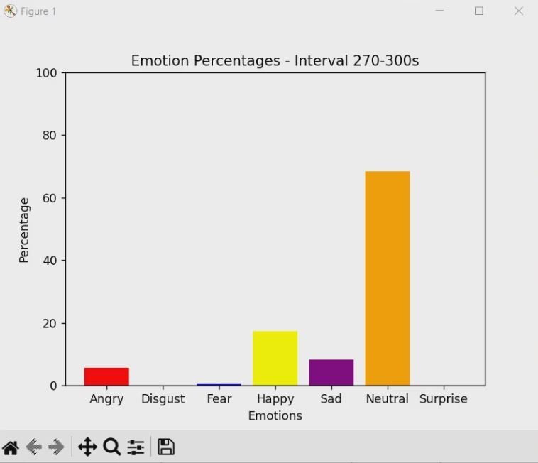

 
